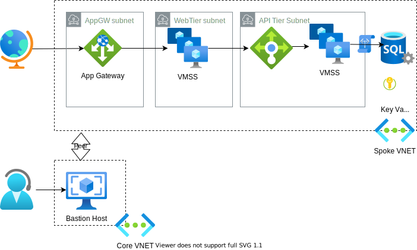

# Deploy an N-Tier Architecture using Terraform

<!-- vscode-markdown-toc -->
* [Purpose](#Purpose)
* [Background](#Background)
	* [When to use this architecture](#Whentousethisarchitecture)
	* [Consider an N-tier architecture for:](#ConsideranN-tierarchitecturefor:)
* [A Sample N-Tier Deployment using Terraform](#ASampleN-TierDeploymentusingTerraform)
* [How to deploy](#Howtodeploy)
    * [Terraform PlanApply Scaffolding](#TerraformPlanApplyScaffolding)
	* [Terraform PlanApply DEV and Terraform PlanApply PROD](#TerraformPlanApplyDEVandTerraformPlanApplyPROD)
	* [Terraform Destroy DEV and Terraform Destroy PROD](#TerraformDestroyDEVandTerraformDestroyPROD)
* [Terraform State](#TerraformState)
    * [Requirements](#Requirements)
    * [Providers](#Providers)
    * [Modules](#Modules)
    * [Resources](#Resources)
    * [Inputs](#Inputs)
    * [Outputs](#Outputs)

<!-- vscode-markdown-toc-config
	numbering=false
	autoSave=true
	/vscode-markdown-toc-config -->
<!-- /vscode-markdown-toc -->

## <a name='Purpose'></a>Purpose

This repository contains a reference implementation of an N-tier application, using terraform to deploy the require infrastructure components and provision the VMSS nodes.  It is deployed using GitHub Actions, and leverages Terraform Cloud to manage terraform state.

Q: Why create another terraform-to-azure demo? A:  We felt that most existing demos did not reflect the complexity that our customers face.  Most existing terraform demos show little more than 'hello world', deploying a single resource to a single environment.  We wanted to create a demo that shows how to deploy a complex application across multiple environments (non-prod, prod).

The terraform code and assets in this repo can be used to showcase:

* Abstraction of code using modules
* Reusability of manifests across different environments (non-prod, prod) through tfvars files and multiple workspaces in terraform cloud
* Use of terraform to generate random passwords and store them in Key Vaults
* "Least-trust" network security enforcement using network security groups

## <a name='Background'></a>Background

_The information in this section comes from the [Azure Architecture Center.](https://learn.microsoft.com/en-us/azure/architecture/guide/architecture-styles/n-tier)_


Layers are a way to separate responsibilities and manage dependencies. Each layer has a specific responsibility. A higher layer can use services in a lower layer, but not the other way around.

In an IaaS deployment, tiers are physically separated, running on separate machines. A tier can call to another tier directly, or use asynchronous messaging (message queue). Although each layer might be hosted in its own tier, that's not required. Several layers might be hosted on the same tier. Physically separating the tiers improves scalability and resiliency, but may add latency from the additional network communication.

A traditional three-tier application has a presentation tier, a middle tier, and a database tier. The middle tier is optional. More complex applications can have more than three tiers. The diagram above shows an application with two middle tiers, encapsulating different areas of functionality.

### <a name='Whentousethisarchitecture'></a>When to use this architecture

N-tier architectures are often implemented as infrastructure-as-service (IaaS) applications, with each tier running on a separate set of VMs. However, an N-tier application doesn't need to be pure IaaS. Often, it's advantageous to use managed services for some parts of the architecture, particularly caching, messaging, and data storage.

### <a name='ConsideranN-tierarchitecturefor:'></a>Consider an N-tier architecture for:

* Simple web applications.
* Migrating an on-premises application to Azure with minimal refactoring.
* Unified development of on-premises and cloud applications.
* N-tier architectures are very common in traditional on-premises applications, so it's a natural fit for migrating existing workloads to Azure.

## <a name='ASampleN-TierDeploymentusingTerraform'></a>A Sample N-Tier Deployment using Terraform

<!-- comment  -->

The code in this repo deploys an illustrative application across a reference environment. The code creates the following components:

* Two VNETs; one for the application and one for a Bastion Host.  These VNETs are peered.  
* The application VNET is divided into multiple subnets.  Each application tier is placed into its own subnet, and NSG rules are applied to only allow communication from the appropriate tiers.
* An App Gateway handles incoming internet traffic.  This directs traffic to:
* A VMSS (with autoscaling rules) handles incoming web traffic (web tier) from the App Gateway.  It makes queries to:
* A load balancer in front of an API tier VMSS (with autoscaling rules).  This tier makes calls to:
* Azure SQL.  Credentials are stored in an Azure Key Vault

The sample application being deployed is the [YADA Application](https://github.com/microsoft/YADA)

## <a name='Howtodeploy'></a>How to deploy

The application can be deployed using a set of GitHub Action workflows.  First, the appropriate secrets must be entered into the repo as secrets.


A service principal is used to authenticate terraform to azure and is stored in the following secrets: `ARM_CLIENT_ID`, `ARM_CLIENT_SECRET`, `ARM_TENANT_ID`, `AZURE_SUBSCRIPTION_ID`.  A PAT is used to authenticate to Terraform Cloud and is stored in the secret `TF_API_TOKEN`.

The actions used to deploy the application are:

#### <a name='TerraformPlanApplyScaffolding'></a>Terraform PlanApply Scaffolding
The workflow **Terraform PlanApply Scaffolding** is used to set up the environment.  It is a 
'one-and-done' workflow, simply used to approve the licensing of the VM image in the manifests.

#### <a name='TerraformPlanApplyDEVandTerraformPlanApplyPROD'></a>Terraform PlanApply DEV and Terraform PlanApply PROD
The workflows **Terraform PlanApply DEV** and **Terraform PlanApply PROD** are used to, respectively, deploy the application to a DEV and to a PROD environment.
The specific parameters for DEV and PROD are stored in the tfvars files `dev.terraform.tfvars` and `prod.terraform.tfvars`.  The main difference between the environments is the resource group, which is specified in the files.

#### <a name='TerraformDestroyDEVandTerraformDestroyPROD'></a>Terraform Destroy DEV and Terraform Destroy PROD
These workflows tear down the environment.

## <a name='TerraformState'></a>Terraform State
Terraform state is stored in Terraform cloud.  Each environment gets its own workspace for storing state:


The workspaces are all tagged as `azure-vm-ref-arch`, and this is used by the terraform code:

```hcl
terraform {
  cloud {
    organization = "mtc"
    workspaces {
      # This will choose all workspaces with this tag.  
      # You will need to subsequently select the workspace for the run, eg 'terraform workspace select prod'
      # or you will need to set the TF_WORKSPACE env variable
      tags = ["azure-vm-ref-arch"]
    }
  }
```
Then, within the workflow, the specific workspace is selected:
```yaml
env:
  # Per https://developer.hashicorp.com/terraform/cli/config/environment-variables
  TF_WORKSPACE: 'vm-ref-arch-scaffold'
```

-----------------
# Terraform Module Documentation

## <a name='Requirements'></a>Requirements

| Name | Version |
|------|---------|
| <a name="requirement_azurerm"></a> [azurerm](#requirement\_azurerm) | =3.26.0 |

## <a name='Providers'></a>Providers

| Name | Version |
|------|---------|
| <a name="provider_azurerm"></a> [azurerm](#provider\_azurerm) | 3.26.0 |
| <a name="provider_random"></a> [random](#provider\_random) | 3.4.3 |

## <a name='Modules'></a>Modules

| Name | Source | Version |
|------|--------|---------|
| <a name="module_api-vmss"></a> [api-vmss](#module\_api-vmss) | ./modules/vmss | n/a |
| <a name="module_app-gateway"></a> [app-gateway](#module\_app-gateway) | ./modules/app_gateway | n/a |
| <a name="module_bastion-host"></a> [bastion-host](#module\_bastion-host) | ./modules/management_tools | n/a |
| <a name="module_db_SQLSERVER"></a> [db\_SQLSERVER](#module\_db\_SQLSERVER) | ./modules/SQLSERVER | n/a |
| <a name="module_load_balancer"></a> [load\_balancer](#module\_load\_balancer) | ./modules/load_balancer | n/a |
| <a name="module_networks"></a> [networks](#module\_networks) | ./modules/networks | n/a |
| <a name="module_web-vmss"></a> [web-vmss](#module\_web-vmss) | ./modules/vmss | n/a |

## <a name='Resources'></a>Resources

| Name | Type |
|------|------|
| [azurerm_key_vault.kv](https://registry.terraform.io/providers/hashicorp/azurerm/3.26.0/docs/resources/key_vault) | resource |
| [azurerm_key_vault_access_policy.kvpolicy](https://registry.terraform.io/providers/hashicorp/azurerm/3.26.0/docs/resources/key_vault_access_policy) | resource |
| [azurerm_key_vault_secret.dbcred](https://registry.terraform.io/providers/hashicorp/azurerm/3.26.0/docs/resources/key_vault_secret) | resource |
| [azurerm_key_vault_secret.vmcred](https://registry.terraform.io/providers/hashicorp/azurerm/3.26.0/docs/resources/key_vault_secret) | resource |
| [azurerm_resource_group.rg](https://registry.terraform.io/providers/hashicorp/azurerm/3.26.0/docs/resources/resource_group) | resource |
| [random_password.dbpassword](https://registry.terraform.io/providers/hashicorp/random/latest/docs/resources/password) | resource |
| [random_password.password](https://registry.terraform.io/providers/hashicorp/random/latest/docs/resources/password) | resource |
| [random_pet.name](https://registry.terraform.io/providers/hashicorp/random/latest/docs/resources/pet) | resource |
| [azurerm_client_config.current](https://registry.terraform.io/providers/hashicorp/azurerm/3.26.0/docs/data-sources/client_config) | data source |

## <a name='Inputs'></a>Inputs

| Name | Description | Type | Default | Required |
|------|-------------|------|---------|:--------:|
| <a name="input_admin_password"></a> [admin\_password](#input\_admin\_password) | Default password for admin account | `string` | `""` | no |
| <a name="input_admin_user"></a> [admin\_user](#input\_admin\_user) | User name to use as the admin account on the VMs that will be part of the VM scale set | `string` | `"azureuser"` | no |
| <a name="input_api_image"></a> [api\_image](#input\_api\_image) | uri of container image used in api tier | `any` | n/a | yes |
| <a name="input_dbname"></a> [dbname](#input\_dbname) | Name of SQL Server db | `string` | `"mydb"` | no |
| <a name="input_resource_group_location"></a> [resource\_group\_location](#input\_resource\_group\_location) | Location of the resource group. | `string` | `"AustraliaCentral"` | no |
| <a name="input_resource_group_name"></a> [resource\_group\_name](#input\_resource\_group\_name) | Name of the resource group. | `any` | n/a | yes |
| <a name="input_resource_group_name_prefix"></a> [resource\_group\_name\_prefix](#input\_resource\_group\_name\_prefix) | Prefix of the resource group name that's combined with a random ID so name is unique in your Azure subscription. | `string` | `"ref-arch-demo"` | no |
| <a name="input_sqladmin"></a> [sqladmin](#input\_sqladmin) | Name of SQL Admin user | `string` | `"dbadmin"` | no |
| <a name="input_web_image"></a> [web\_image](#input\_web\_image) | uri of container image used in web tier | `any` | n/a | yes |

## <a name='Outputs'></a>Outputs

| Name | Description |
|------|-------------|
| <a name="output_app-gtw-ip"></a> [app-gtw-ip](#output\_app-gtw-ip) | n/a |
| <a name="output_appgwurl"></a> [appgwurl](#output\_appgwurl) | n/a |
| <a name="output_application_gateway_name"></a> [application\_gateway\_name](#output\_application\_gateway\_name) | n/a |
| <a name="output_bastion-ip"></a> [bastion-ip](#output\_bastion-ip) | n/a |
| <a name="output_bastion_dns_name"></a> [bastion\_dns\_name](#output\_bastion\_dns\_name) | n/a |
| <a name="output_dbpassword"></a> [dbpassword](#output\_dbpassword) | n/a |
| <a name="output_lb_backend_pool_ids"></a> [lb\_backend\_pool\_ids](#output\_lb\_backend\_pool\_ids) | n/a |
| <a name="output_mid_tier_lb_name"></a> [mid\_tier\_lb\_name](#output\_mid\_tier\_lb\_name) | n/a |
| <a name="output_password"></a> [password](#output\_password) | n/a |
| <a name="output_resource_group_name"></a> [resource\_group\_name](#output\_resource\_group\_name) | n/a |
| <a name="output_subnet-api"></a> [subnet-api](#output\_subnet-api) | n/a |
| <a name="output_subnet-appgtw"></a> [subnet-appgtw](#output\_subnet-appgtw) | n/a |
| <a name="output_subnet-data"></a> [subnet-data](#output\_subnet-data) | n/a |
| <a name="output_subnet-mgmt"></a> [subnet-mgmt](#output\_subnet-mgmt) | n/a |
| <a name="output_subnet-web"></a> [subnet-web](#output\_subnet-web) | n/a |